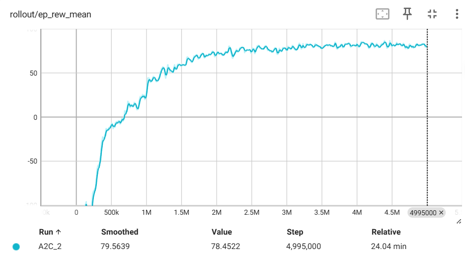
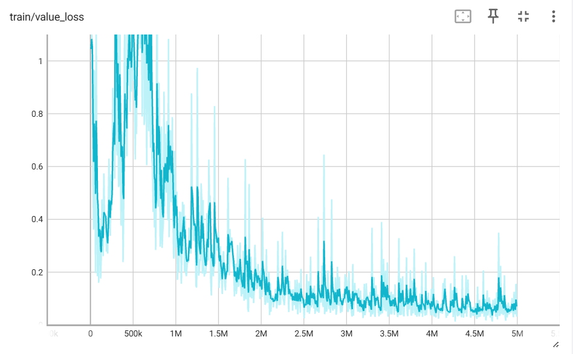

# A2C算法简介

### A2C算法简单描述

A2C（Advantage Actor-Critic，优势演员-评论家）是无模型、同策略的经典强化学习算法，是A3C的同步优化版本。核心是通过“演员-评论家”双网络协同优化，结合优势函数降低策略梯度估计方差，同时引入n步回报平衡偏差与方差、加入熵正则保障探索性，实现稳定且高效的训练。

### 核心公式

1. 策略梯度（核心优化目标）： $\nabla_\theta J(\theta) = \mathbb{E}\left[ \nabla_\theta \log \pi_\theta(a_t|s_t) \cdot A(s_t,a_t) \right]$ 

2. 优势函数（TD误差近似）： $A(s_t,a_t) \approx \delta_t^{(n)} = G_t^{(n)} - V_\phi(s_t)$ （ $G_t^{(n)}$ 为n步回报）

3. 策略熵（探索性保障）： $H(\pi_\theta(\cdot|s_t)) = - \sum_a \pi_\theta(a|s_t) \log \pi_\theta(a|s_t)$ （离散动作空间）

### 核心两点

1. 双网络协同+多机制优化：Actor（策略网络 $\pi_\theta$ ）负责输出动作概率、学习决策；Critic（价值网络 $V_\phi$ ）负责评估状态价值，为Actor提供更新依据；同时引入n步回报（平衡偏差与方差）、熵正则（避免策略过早收敛、保障探索性），三者协同提升训练稳定性和效果。

2. 优势函数降方差核心：用优势函数 $A(s_t,a_t)$ （结合n步回报优化）替代原始策略梯度中的累计回报 $G_t$ ，在保证梯度无偏性的前提下，大幅降低梯度估计方差，解决纯策略梯度算法训练波动大、收敛慢的问题。

### 适用场景
A2C适用于离散或连续动作空间的强化学习任务，尤其在状态空间较大、需要稳定训练的环境中表现优异。常见应用包括：
- 游戏AI（如Atari、棋类游戏）
- 机器人控制（如机械臂、移动机器人）
- 资源管理（如数据中心调度、网络流量控制）
- 金融交易（如股票投资策略）
A2C通过其稳定高效的训练机制，在众多强化学习任务中取得了显著成果，成为强化学习领域的重要算法之一。

### 实现效果描述
- 成功率可达95%以上甚至更高，训练稳定，收敛速度较快。
- 损失曲线如下

