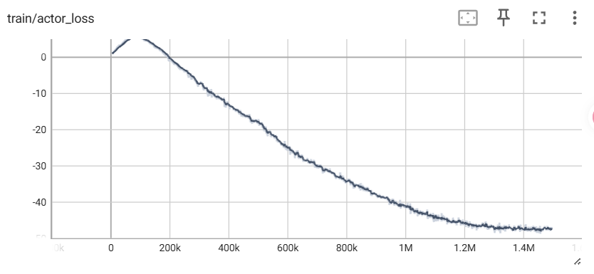
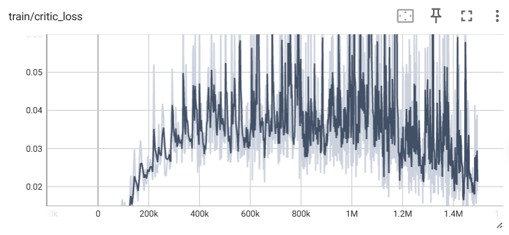

# DDPG 算法核心总结

## 算法结果展示

## 一句话核心定位

​	DDPG（Deep Deterministic Policy Gradient，深度确定性策略梯度）是 **基于确定性策略梯度定理、off-policy 异策略、确定性策略型的 Actor-Critic 算法**，是 DQN 在连续动作空间的里程碑式拓展，也是连续动作控制领域的奠基性基线算法，彻底解决了 DQN 无法处理高维连续动作、传统随机策略梯度样本效率低的核心痛点。

## 核心设计思想（算法灵魂）

​	区别于 A2C、SAC 的随机策略框架，DDPG 采用 **确定性策略单目标优化**，核心是用确定性策略替代随机策略，大幅降低策略梯度估计方差，同时迁移 DQN 的稳定训练技巧，实现连续动作空间的端到端稳定训练。

核心优化目标为：

​		**$\text{核心优化目标} = \text{最大化累计期望回报}$ **

​	核心区别于 A2C、SAC：DDPG 无任何熵相关的优化项，核心目标仅为最大化累计奖励，既没有 A2C 的辅助熵正则项，更没有 SAC 与奖励平级的熵核心目标；同时 DDPG 是确定性策略，输入状态直接输出唯一确定的动作值，而非动作概率分布，这是它与另外两个算法最本质的差异。

## 四大核心组件（算法核心支撑）

|         核心组件          |                           核心作用                           |                        解决的核心痛点                        |
| :-----------------------: | :----------------------------------------------------------: | :----------------------------------------------------------: |
| 确定性策略梯度定理（DPG） | 推导确定性策略的梯度更新规则，仅对状态求期望即可得到无偏梯度，大幅降低梯度估计方差 | 随机策略梯度需对动作和状态双重求期望，梯度估计方差大、训练波动剧烈、收敛慢的问题 |
|  Actor-Critic 双网络架构  | Actor 负责输出确定性连续动作，Critic 负责拟合动作价值函数，为 Actor 提供精准的梯度更新方向，双网络协同优化 | 纯价值迭代无法直接输出高维连续动作、纯策略梯度无价值评估导致样本效率极低的问题 |
|  经验回放+目标网络软更新  | 经验回放实现 off-policy 样本复用，打破时序样本的强相关性；软更新缓慢更新目标网络，稳定 TD 目标计算 | 时序样本强相关导致深度网络训练不稳定、TD 目标随主网络频繁波动的“移动靶”训练发散问题 |
|     外加噪声探索机制      | 给确定性动作添加时序相关的 OU 噪声/高斯噪声，补充策略的探索能力，平衡探索与利用 | 确定性策略无天然随机性，无法探索环境、极易陷入局部最优的核心缺陷 |

## 极简核心训练流程

1. **环境交互采样**：用当前确定性策略输出动作，添加探索噪声后执行，将样本 $(s,a,r,s',done)$ 存入大容量经验回放池（off-policy 核心，支持样本重复利用）；

2. **批量样本采样**：当回放池样本数量达标后，随机采样批量训练样本，打破时序数据的强相关性；

3. **Critic 网络更新**：用目标 Actor 和目标 Critic 网络计算 TD 目标，最小化主 Q 网络输出与 TD 目标的均方误差，梯度下降更新 Critic 参数；

4. **Actor 网络更新**：固定 Critic 参数，基于确定性策略梯度定理，最大化 Critic 对策略输出动作的打分，梯度上升更新 Actor 策略参数；

5. **目标网络软更新**：用极小的软更新系数 $\tau$ ，缓慢更新目标 Actor 和目标 Critic 的参数，保证 TD 目标持续稳定，循环迭代直至训练终止。

## 核心优缺点

### 核心优势

1. **原生适配高维连续动作空间**：彻底解决了 DQN 离散化动作的维度爆炸问题，无需离散化即可直接输出高精度连续控制量，是首个能在复杂连续控制任务中稳定收敛的深度强化学习算法。

2. **样本效率高**：off-policy 特性搭配经验回放池，历史样本可重复利用，样本复用率远超 A2C、PPO 等 on-policy 算法，尤其适合采样成本高的真实物理场景。

3. **梯度估计方差小**：确定性策略梯度仅需对状态求期望，无需对动作空间积分采样，梯度估计噪声远小于随机策略梯度，收敛速度更快。

4. **工程实现简洁**：网络结构和更新逻辑简单清晰，无复杂的自适应参数、多网络加权机制，硬件推理开销低，易作为基础框架拓展改进。

5. **策略执行效率高**：确定性策略输入状态直接输出动作，无需采样过程，部署后推理延迟极低，完美适配对实时性要求极高的工业控制、自动驾驶等场景。

### 核心局限

1. **训练稳定性极差，超参数高度敏感**：单 Q 网络极易出现 Q 值过估计，导致策略发散、训练崩溃，复现难度大，对学习率、噪声系数、软更新系数等超参数的调优要求极高。

2. **探索能力弱且难平衡**：确定性策略无天然探索性，完全依赖外加噪声，噪声过小会导致探索不足、陷入局部最优，噪声过大会导致训练不稳定、无法收敛，难以适配稀疏奖励、长周期任务。

3. **环境鲁棒性差**：确定性策略对环境噪声、执行器扰动、传感器误差的适配能力极弱，在动态不确定的真实环境中，表现远不如 SAC 的随机策略。

4. **严重的 Q 值过估计问题**：单 Q 网络的 TD 目标依赖自身输出，会持续高估动作价值，最终导致 Critic 评估失准、Actor 策略更新方向错误，这是 DDPG 最核心的固有缺陷。

5. **训练耦合性强**：Actor 的更新完全依赖 Critic 的价值评估，Critic 的拟合偏差会持续累积，极易出现“评论家估错，演员学歪”的耦合崩溃问题。

## 核心适用场景

DDPG 是 **低噪声、高确定性、短回报周期的连续动作控制任务** 的经典基线算法，核心落地场景包括：

- 工业精准控制：电机转速闭环调节、机械臂定点抓取/装配、化工反应连续参数优化、数控机床轨迹跟踪；

- 机器人稳态控制：低自由度机器人运动控制、四足机器人稳态行走、固定场景下的机械臂轨迹规划；

- 智能驾驶辅助：定速巡航车速连续调节、车道保持方向盘转角控制、固定路线自主泊车轨迹跟踪；

- 算法教学与拓展：连续动作控制、Actor-Critic 框架的经典教学案例，是 TD3、SAC 等进阶连续控制算法的核心前置基础；

- 低延迟实时控制：确定性策略无需采样，推理速度快，适合对延迟要求极高的嵌入式实时控制场景。