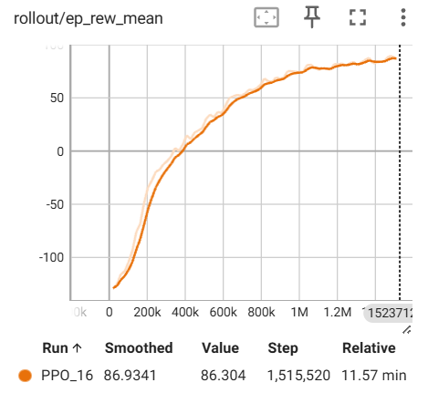
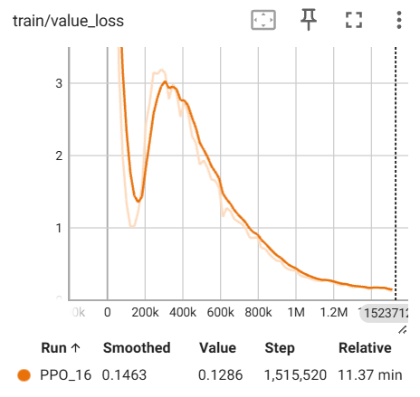

# fr3_reach_rl — 项目说明（PPO、配置与环境细节）

本仓库实现了基于 MuJoCo 的 Franka FR3 机械臂到达随机目标点任务环境与基于 Stable-Baselines3 的 PPO 训练管线。目的是为了自己学习。

**效果如下:**




**成功率可达95%以上，平均距离小于0.02米，且动作平滑稳定。**


下面将说明：
- PPO 算法简介（要点）
- 配置文件中关键参数的含义（`config.py`）
- 环境（`fr3_env.py`）的动作空间、观测空间与奖励机制
- 快速使用说明

**1. PPO 算法简介**
- 本实现使用的是 Proximal Policy Optimization（PPO），属于 on-policy 策略梯度方法。核心思想是通过裁剪（clip）策略比值的损失函数限制更新幅度，从而稳定训练。常见组件：优势函数估计（GAE）、价值网络和值函数损失、熵正则化以鼓励探索。
- 关键超参数及其作用（本仓库中可在 `TRAIN_CONFIG` 中设置）：
	- `learning_rate`：优化器学习率。
	- `n_steps`：每个环境连续采样的步数（构成一个 rollout batch）。
	- `batch_size`：每次梯度更新的批量大小（来自并行环境后样本合并）。
	- `n_epochs`：在同一采样数据上做梯度更新的轮数（越大拟合越多但易过拟合）。
	- `gamma`：折扣因子，控制未来奖励折扣。
	- `gae_lambda`：GAE 的衰减系数，用于平衡偏差-方差。
	- `clip_range`：裁剪范围，限制策略比值变动。
	- `ent_coef`：熵系数，控制策略探索程度。
	- `vf_coef`：价值函数损失系数。
	- `max_grad_norm`：梯度裁剪阈值，保证训练稳定性。

**2. 配置参数（来自 `config.py`）**
- 路径相关：
	- `MODEL_PATH`：MuJoCo 模型 XML 文件路径（models/fr3_reach.xml）。
	- `LOG_DIR`：TensorBoard 日志目录（`logs/`）。
	- `SAVE_DIR`：训练模型保存目录（`saved_models/`）。
- 训练相关（`TRAIN_CONFIG`）：
	- `total_timesteps`：训练总步数（如 1_500_000）。
	- `n_envs`：并行环境数量（例如 10），影响样本采集速度与批量尺寸。
	- `learning_rate`、`n_steps`、`batch_size`、`n_epochs`、`gamma`、`gae_lambda`、`clip_range`、`ent_coef`、`vf_coef`、`max_grad_norm`：见上节 PPO 说明。
- 环境相关（`ENV_CONFIG`）：
	- `max_steps`：单个 episode 最大步数（训练/测试中使用，本仓库为 300）。
	- `n_substeps`：每个 RL step 执行的物理仿真子步数（例如 5 或 10），决定控制频率（timestep * n_substeps）。
- 测试相关（`TEST_CONFIG`）：
	- `n_episodes`：评估时的 episode 数量。
	- `max_steps`：测试时的最大步数（与训练保持一致以避免分布偏移）。
	- `render`：是否可视化渲染。

**3. 环境实现要点（`fr3_env.py`）**
- 环境类：`FR3ReachEnv(gym.Env)`，基于 MuJoCo 的 FR3 模型（models/fr3_reach.xml）。
- 重要成员：
	- `home_qpos`：7 关节的 home 初始位置。
	- `target_range`：目标球在空间中的随机采样范围。
	- `ee_site_id` / `target_body_id`：通过 `mj_name2id` 获取的站点/物体 id，用于读取末端和目标坐标。

- 动作空间（Action Space）：
	- 类型：连续空间 `Box`。
	- 形状：7（对应 7 个关节）。
	- 范围：`low=-0.03, high=0.03`（单位：rad），表示每个 RL step 对关节角的增量（delta q）。
	- 应用方式：在 `step()` 中将动作与当前 `qpos[:7]` 相加得到目标关节角，然后裁剪到模型的 `actuator_ctrlrange[:7]` 并写入 `data.ctrl[:7]`，随后执行若干物理子步使其生效。

- 观测空间（Observation Space）：
	- 类型：连续空间 `Box`。
	- 形状：21 维向量，按顺序为：
		1) 关节位置（qpos）7维
		2) 关节速度（qvel）7维
		3) 末端（end-effector）位置（ee_pos）3维
		4) 目标位置（target_pos）3维
		5) 末端到目标的距离（distance）1维
	- 数据类型：float32。

**4. 奖励机制（Reward）与成功判定**
- 奖励由多项组成，设计目标是在导向末端靠近目标的同时保持动作平滑与稳定：
	- 基础项：负距离项（`-distance`），鼓励末端靠近目标。
	- 指数塑形：`0.5 * exp(-10.0 * distance)`，当距离非常小时提供额外的诱导，帮助收敛。
	- 进展奖励（progress）：上一时刻距离减去当前距离（`prev_distance - distance`），表示向目标靠近的增量。
	- 动作惩罚（action_penalty）：`0.01 * ||action||`，抑制过大/剧烈动作，提升平滑性。
	- 成功奖励：当满足稳定性判定（见下）且连续若干步时，额外给予 `+10.0` 大额奖励并将 `terminated=True`。

 - 奖励计算（伪代码）：
	 reward = -distance + 0.5 * exp(-10*distance) + 1.0 * progress - 0.01 * ||action||
	 if stable_count >= success_consecutive: reward += 10.0; terminated = True

 - 成功与稳定性判定条件：
	 - 距离阈值：`success_threshold = 0.05` 米（即末端与目标距离小于 5cm）。
	 - 末端速度阈值：`ee_vel_threshold = 0.02` m/s（保证到达时较为静止）。
	 - 连续帧数：`success_consecutive = 2`（需连续满足上述条件若干步以避免偶发判定）。

 - Episode 结束条件：
	 - 成功到达（如上，`terminated=True`）。
	 - 步数超限（`truncated=True`），当 `current_step >= max_steps` 时结束。

**5. 快速使用说明**
- 训练：

```bash
cd fr3_reach_rl
python train.py
```

训练时会读取 `config.py` 中的 `TRAIN_CONFIG` 与 `ENV_CONFIG`；并行环境的数量由 `TRAIN_CONFIG['n_envs']` 决定。

- 日志与模型：
	- TensorBoard 日志目录：`LOG_DIR`（默认 `logs/`）。
	- 最终模型保存：`SAVE_DIR/fr3_reach_final.zip`（默认 `saved_models/`）。

**6. 备注与调试建议**
- 若训练不稳定或学不出策略：尝试减小动作尺度（`action_space` 范围）、减小 `learning_rate`、增大 `n_envs` 或调整 `n_steps/batch_size` 配比。
- 若发现断言失败（找不到 site/body）：检查 `models/fr3_reach.xml` 中站点与 body 名称是否与 `fr3_env.py` 中的 `mj_name2id` 调用一致（`attachment_site`、`target` 等）。


