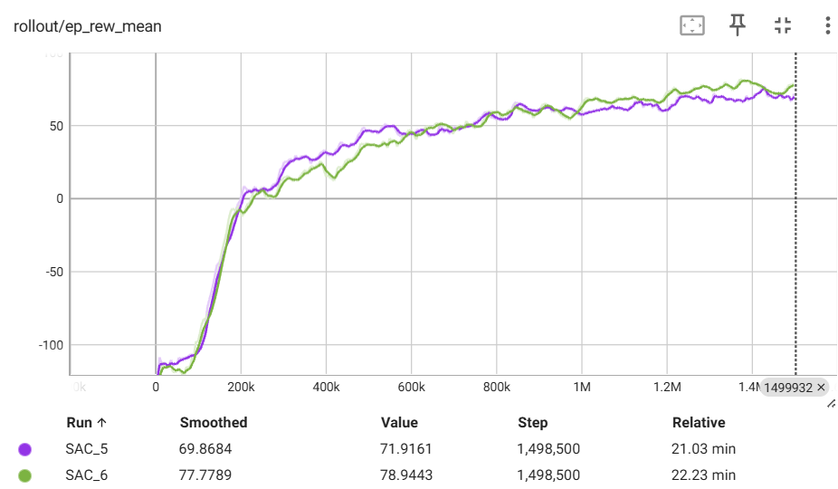
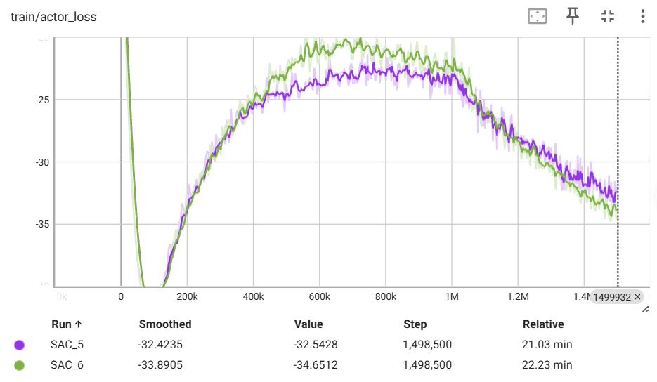
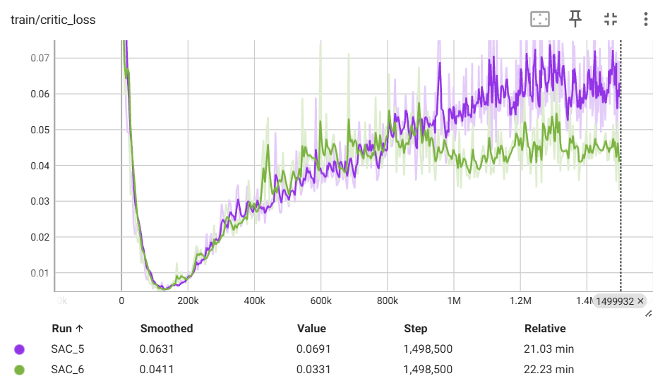
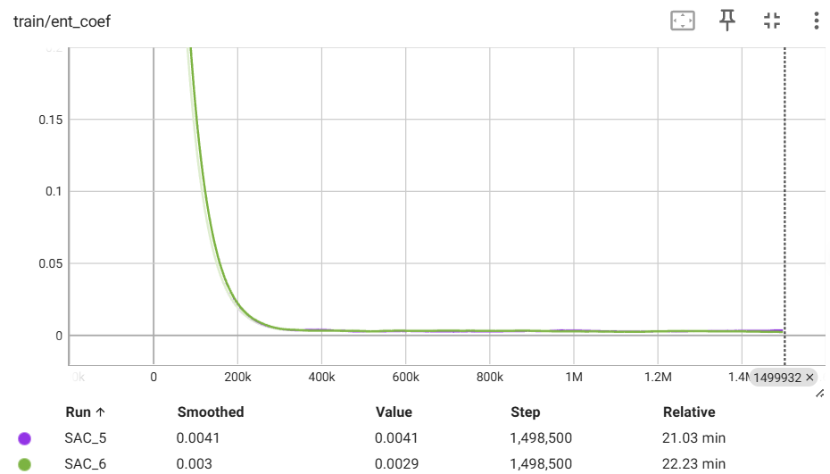

# SAC 算法

### SAC算法简单描述

SAC（Soft Actor-Critic，软演员-评论家）是无模型、异策略（off-policy）的深度强化学习算法，基于最大熵强化学习框架，是Actor-Critic架构的进阶版本。它核心改进是将“最大化累计奖励”与“最大化策略熵”结合，引入双Q网络和目标网络解决Q值过估计问题，支持连续动作空间，样本效率、训练稳定性和鲁棒性均优于传统Actor-Critic算法（如A2C），同时无需复杂的多线程同步，工程落地灵活，是连续控制任务的首选算法之一。

### 核心公式（关键核心公式，不冗余）

1. 最大熵目标函数（核心优化目标）： $J(\pi) = \mathbb{E}_{\tau \sim \pi}\left[ \sum_{t=0}^{T-1} \gamma^t \left( r_{t+1} + \alpha H(\pi(\cdot|s_t)) \right) \right]$ ，其中 $\alpha$ 为温度参数，控制熵的权重， $H(\pi)$ 为策略熵。

2. 策略熵（探索性核心，连续动作空间）： $H(\pi(\cdot|s_t)) = -\int \pi(a|s_t) \log \pi(a|s_t) da$ ，熵越大，策略随机性越强，探索性越好。

3. 软Q网络损失（Critic更新核心）： $L_Q = \mathbb{E}\left[ \left( Q(s,a) - \left( r + \gamma \mathbb{E}_{s' \sim \mathcal{D}} \min(Q_1'(s',a'), Q_2'(s',a')) \right) \right)^2 \right]$ ，双Q网络取最小值避免过估计。

### 核心两点

1. 最大熵软策略设计：区别于A2C的“熵正则辅助探索”，SAC将策略熵最大化作为核心优化目标之一，通过温度参数 $\alpha$ 平衡“累积奖励最大化”与“探索多样性”，天然避免策略过早收敛到局部最优，提升鲁棒性，适配复杂动态环境。

2. 双Q+目标网络+异策略架构：采用双Q网络（ $Q_1, Q_2$ ）和对应的目标网络，有效解决Q值过估计问题；异策略特性可复用历史样本（无需丢弃旧样本），大幅提升样本效率，同时适配高维连续动作空间，无需对动作进行离散化处理。

### 核心使用场景（重点，结合实际落地，分场景说明适配原因）

SAC的核心优势的是“连续动作适配、样本高效、鲁棒性强、探索能力优”，因此主要用于**连续动作控制、复杂动态环境、高样本效率需求**的场景，具体如下：

1. 连续动作空间控制场景（核心场景）：这是SAC最主要的应用场景，适配所有需要输出连续动作的任务，无需对动作离散化，避免信息丢失。例如：机器人关节控制（如机械臂抓取、四足机器人行走）、无人机自主导航（三维未知环境避障、悬停）、自动驾驶（车速调节、方向盘转角控制）、工业设备参数调节（如化工反应参数、电机转速控制），在MuJoCo系列连续控制环境中表现远超DDPG、A2C等算法。

2. 稀疏奖励/长周期任务场景：适用于奖励稀疏、需要长期探索才能获得有效反馈的任务。例如：机器人开门、复杂路径规划、稀疏奖励下的无人机目标追踪，SAC的最大熵探索能鼓励智能体尝试更多动作，避免陷入局部最优，同时异策略的样本复用特性，减少稀疏奖励下的样本浪费，提升训练效率，在DoorOpening等稀疏奖励任务中成功率远高于传统算法。

3. 高鲁棒性需求的动态环境场景：适用于环境存在扰动、不确定性高的实际工程场景。例如：动态障碍物下的机器人导航、风速变化时的无人机飞行控制、自动驾驶中的突发路况应对，SAC的随机策略对环境扰动更敏感、鲁棒性更强，相比确定性策略（如DDPG），能更好地适应环境变化，减少因传感器噪声、执行器误差导致的性能下降。

4. 高维观测/复杂决策场景：适用于观测空间维度高、决策逻辑复杂的任务，无需手动设计特征。例如：基于图像输入的机器人抓取（视觉观测）、高自由度机器人控制（如24自由度的ShadowHand机器人）、智能电网调度（多维度电力参数决策），SAC的网络架构能有效提取高维特征，适配复杂决策需求，样本效率是传统算法的3倍以上。

5. 实际工程落地场景：由于训练稳定、无需繁琐调参、适配真实环境的不确定性，SAC广泛应用于工业、金融、机器人等领域。例如：工业生产线上的机器人搬运、智能电网的电力分配调度、金融投资中的资产配置决策，能在无需大量人工干预的情况下，实现自主优化决策。

补充：SAC几乎不用于“纯离散动作空间”（如CartPole、Atari游戏），这类场景优先选择A2C、PPO等算法；其核心优势在连续动作、复杂动态环境中才能充分发挥，是实际工程落地中连续控制任务的首选算法之一。

### 实现效果描述
- 成功率可达95%以上甚至更高，训练稳定，收敛速度较快。
- 损失曲线如下

