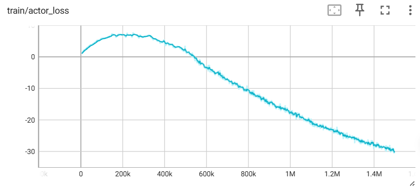
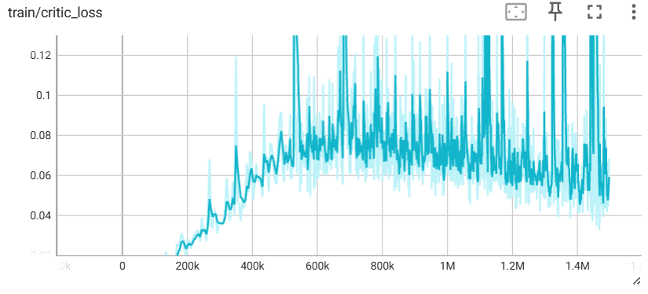

# TD3 算法核心总结

## 算法结果展示

## 一句话核心定位

​	TD3（Twin Delayed Deep Deterministic Policy Gradient，双延迟深度确定性策略梯度）是 **针对 DDPG 核心缺陷优化的无模型、off-policy 异策略、确定性策略型 Actor-Critic 算法**，是连续动作控制领域的工业级强基线算法，通过三大针对性改进从根源上解决了 DDPG Q 值严重过估计、训练极易崩溃、超参数高度敏感的致命痛点，是目前确定性策略算法的首选落地方案。

## 核心设计思想（算法灵魂）

​	TD3 的核心优化目标与 DDPG 完全一致，为 **最大化确定性策略的累计期望回报**，无任何熵相关优化项，既没有 A2C 的辅助熵正则，更没有 SAC 与奖励平级的熵核心目标。

​	它的核心设计逻辑，是针对 DDPG 的三大底层缺陷，通过「截断双 Q 学习、延迟策略更新、目标策略平滑正则化」三大耦合协同的机制，抑制价值估计误差、平衡 Actor 与 Critic 的更新节奏、平滑价值函数，在完整保留 DDPG 低延迟、高样本效率核心优势的同时，彻底解决其训练不稳定的固有缺陷。

​	**本质区别**：和 DDPG 一致为确定性策略，输入状态直接输出唯一确定的动作值，而非动作概率分布；区别于随机策略算法，它无天然探索性，需外加噪声补充探索能力。

## 四大核心组件（算法核心支撑）

| 核心组件                           | 核心作用                                                     | 解决的核心痛点                                               |
| ---------------------------------- | ------------------------------------------------------------ | ------------------------------------------------------------ |
| 截断双 Q 学习机制                  | 同时训练两个完全独立、参数不共享的 Critic 网络，计算 TD 目标时取双网络输出的最小值做保守价值估计，两个网络共用同一个 TD 目标同步更新 | DDPG 单 Q 网络导致的 Q 值无界过估计、误差持续累积形成恶性循环的核心痛点 |
| 延迟策略与目标网络更新             | Critic 网络每步训练均更新，Actor 与所有目标网络（双目标 Critic、目标 Actor）每间隔 d 步（默认 2 步）才更新 1 次，解耦二者更新频率 | DDPG 中 Actor 与 Critic 更新不匹配、Critic 未收敛就引导策略更新导致的训练失稳、价值估计偏差持续放大的问题 |
| 目标策略平滑正则化                 | 给目标 Actor 输出的动作添加截断高斯噪声，约束相邻动作的价值差异，让价值函数更平滑 | DDPG 确定性策略导致的价值函数尖峰化、策略对动作噪声极度敏感、泛化性与鲁棒性差的问题 |
| 确定性策略梯度+off-policy 基础架构 | 基于确定性策略梯度定理（DPG）做策略更新，搭配大容量经验回放池实现样本复用 | 随机策略梯度估计方差大、on-policy 算法样本效率低的问题，完整保留 DDPG 的核心优势 |

## 极简核心训练流程

1. **环境交互采样**：用当前确定性策略输出动作，添加高斯探索噪声并裁剪到动作空间范围内，执行动作后将样本 $(s,a,r,s',done)$ 存入大容量经验回放池，实现 off-policy 样本复用；

2. **批量样本采样**：当回放池样本数量达标后，随机采样批量训练样本，打破时序数据的强相关性；

3. **Critic 网络更新**：给目标动作添加截断平滑噪声，取双目标 Critic 输出的最小值计算 TD 目标，最小化双 Critic 网络的 TD 均方误差，每步训练均更新 Critic 参数；

4. **延迟更新 Actor 与目标网络**：Critic 每更新 d 步后，固定 Critic 参数，基于确定性策略梯度定理最大化 Q 值，梯度上升更新 Actor 参数，同时软更新所有目标网络参数；

5. **循环迭代**：重复上述环境交互与网络训练步骤，直至达到训练终止条件。

## 核心优缺点

### 核心优势

1. **训练稳定性拉满，彻底解决 DDPG 的崩溃问题**：三大改进从根源上抑制 Q 值过估计，打破误差累积的恶性循环，几乎不会出现 DDPG 的训练发散问题，复现性极强，是目前最稳定的确定性策略算法。

2. **样本效率高，收敛性能优异**：完整保留 off-policy 特性与经验回放机制，样本复用率高，在绝大多数连续控制基准任务中，收敛速度和最终性能均远超 DDPG，部分场景可对标 SAC。

3. **超参数鲁棒性大幅提升**：相比 DDPG 对超参数的高度敏感，TD3 的默认超参数即可适配绝大多数连续控制任务，调参成本显著降低。

4. **策略鲁棒性与泛化性强**：目标策略平滑正则化让价值函数更平滑，策略对环境噪声、执行器扰动的适配能力远强于 DDPG，更适配真实物理场景的落地需求。

5. **工程实现简单，部署推理延迟极低**：相比 SAC 无需计算对数概率、自适应温度系数，网络结构简洁，计算开销低；确定性策略无需动作采样，部署后推理延迟极低，完美适配高实时性的工业控制场景。

### 核心局限

1. **探索能力仍有固有局限**：本质为确定性策略，无天然探索性，完全依赖外加高斯噪声，在稀疏奖励、长周期任务中，探索能力远不如 SAC 的最大熵随机策略，极易陷入局部最优。

2. **原生仅适配连续动作空间**：和 DDPG 一致，算法设计围绕连续动作展开，离散动作空间需大幅修改核心结构，适配性远不如 PPO、A2C。

3. **极端场景仍需调优**：在极端稀疏奖励、高维动作空间、超长回报周期的任务中，仍需对噪声系数、延迟更新步长等超参数进行针对性微调。

4. **强动态环境适配性弱于 SAC**：确定性策略在强不确定性、强动态变化的环境中，泛化性和鲁棒性仍不及 SAC 的随机策略，无法适配多模态的最优动作分布。

## 核心适用场景

TD3 是 **需要确定性控制、低延迟、高稳定性的连续动作任务** 的首选落地算法，核心适用场景包括：

- 工业精准控制：电机转速闭环调节、机械臂定点抓取/装配、数控机床轨迹跟踪、化工反应连续参数优化等对控制确定性、实时性要求极高的场景；

- 机器人稳态控制：四足机器人行走、低自由度机械臂轨迹规划、固定场景机器人操作等需要平滑、稳定运动控制的场景；

- 智能驾驶辅助：定速巡航车速调节、车道保持方向盘转角控制、固定路线自主泊车等需要连续、低延迟确定性控制指令的车载嵌入式场景；

- 航空航天控制：无人机悬停与轨迹跟踪、卫星姿态控制、飞行器稳定控制等对控制稳定性和鲁棒性要求严苛的场景；

- 学术研究与工程基线：是连续动作控制领域的标准强基线，结构清晰、复现性强，是算法改进、效果对比的基准参考。