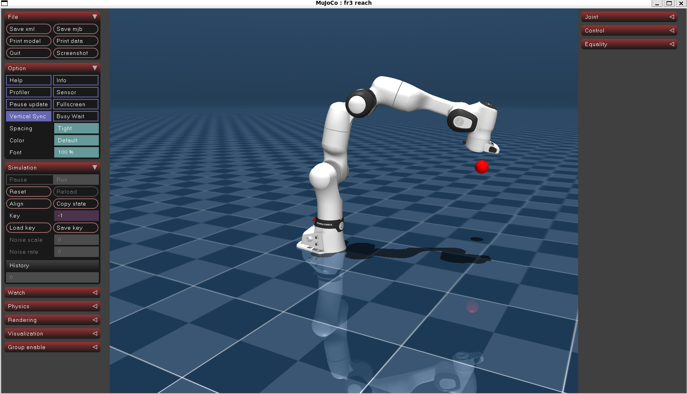

# FR3 Reach RL (PPO/A2C/SAC)

这是一个用于 FR3 机械臂到达（reach）任务的强化学习仓库，包含基于 MuJoCo 的环境和若干强化学习算法的实现（PPO、A2C、SAC）。项目用于训练、评估和保存控制策略模型，并提供训练日志与可视化支持。初衷是为了自己去学习强化学习算法以及使用 MuJoCo 进行机器人控制的实践，同时也欢迎其他人参考和使用。

## 项目概览

- **目的**：使用强化学习训练 FR3 机械臂完成目标到达任务（reach）。
- **算法**：包含 PPO、A2C、SAC 等常见策略优化算法的训练与测试脚本。
- **基于**：MuJoCo 仿真环境（请确保已正确安装并配置 MuJoCo 及相应的 Python 绑定）。
- **我使用的设备**：RTX5060Ti 16G 支持 CPU 和 GPU 训练。


## 目录结构（概要）

- `FR3_PPO/`、`FR3_A2C/`、`FR3_SAC/`：各算法的配置、环境封装、训练与测试脚本。
- `models/`：与机器人模型相关的 MJCF/资产文件（如 `fr3_reach.xml`）。
- `requirements.txt`：Python 依赖列表（位于仓库根或子项目中）。
- `saved_models/`、`logs/`：训练产生的模型和日志目录（各算法子目录下存在各自的 `saved_models`/`logs`）。

## 依赖与安装

建议使用虚拟环境（conda 或 venv），然后安装依赖：

```bash
pip install -r requirements.txt
```

请确保系统上已安装并配置 MuJoCo（包含许可证与 `mujoco` 包/`mujoco-py` 或新版 `mujoco` Python 绑定），以及显卡驱动/依赖（如需加速）。

## 快速开始

训练（示例）——在对应算法目录下运行训练脚本：

```bash
python FR3_PPO/train.py
# 或
python FR3_A2C/train.py
python FR3_SAC/train.py
```

测试/评估（示例）：

```bash
python FR3_PPO/test.py
```

日志与可视化（例如 TensorBoard）：

```bash
tensorboard --logdir FR3_PPO/logs
```

模型文件通常保存在各算法目录下的 `saved_models/` 中。

## 配置

每个子目录下都有 `config.py` 用于设置超参数、训练步数、环境参数等。根据需要修改对应 `config.py` 后再启动训练。

## 注意事项

- MuJoCo 版本与 Python 绑定差异可能导致环境接口不同，请参照系统环境与代码中的 `fr3_env.py` 做相应适配。
- 若在头文件或依赖安装中遇到问题，先检查 `requirements.txt` 并确认 MuJoCo 运行正常。


